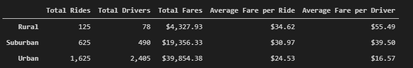
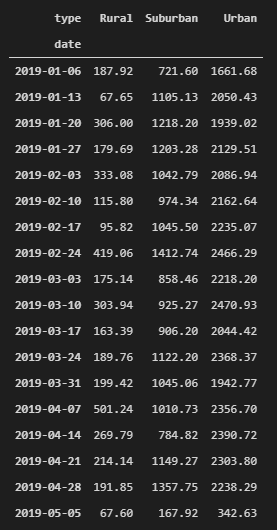
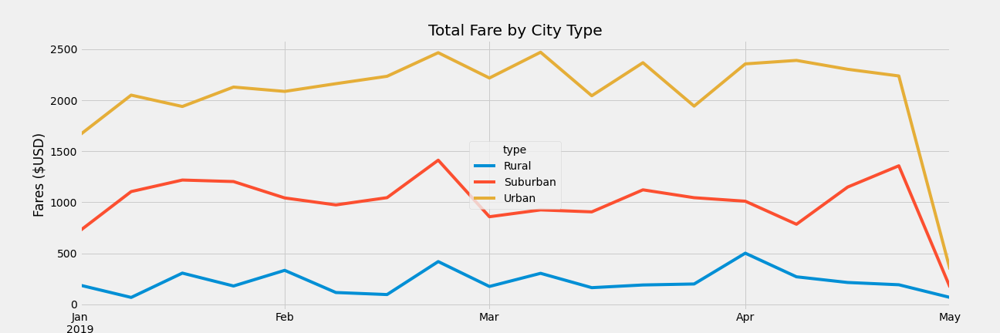

# PyBer Analysis

## Overview of Project

The purpose of this analysis project is to create a summary DataFrame of the PyBer ride data, grouped by city type (Urban, Suburban, Rural). A line graph was then created to help visualize this data, and how it can be used to better understand the differences in resources and revenue for these three sizes of population.

### Resources
- city_data.csv

- ride_data.csv
---
---

## Results

### Summary Data Frame
Using the data provided in the .csv files, the ride fare data was grouped by city size for the following categories:

### Resampled Data
It was then resampled to show the results per week, as follows:

### Line Graph
Then the following line graph was generated to help visualize these weekly results:

              
 
--- 

### Analysis

- As only one day was included for the last week of April, the drastic drop-off at the end of that month is from a lack of data, not a crash in ride numbers.
  
- The suburban and urban groups have a more variable fare total than does the rural group.
  
- The third week of February seemed to be high volume for all three groups.
  
- Although it takes more rides to acheive, the urban group had much higher totals at any given time than the other two groups.
---
---

## Summary

### Recommendations Based on the Data

- There appears to be too many urban drivers for the number of rides, so perhaps shifting these extra drivers to the suburban areas if possible.
  
- Increase driver numbers after the middle of the month, as the ride total seems to go up around this time, peaking around the end of each month.
  
- With the limited data we have available here, it seems fare totals are lower in January, so limiting driver count around the new year might be in order.